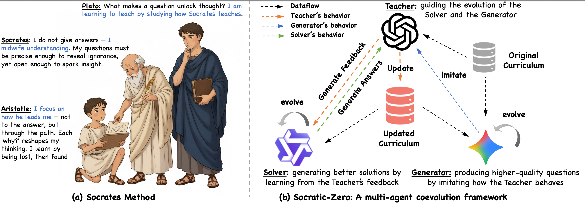
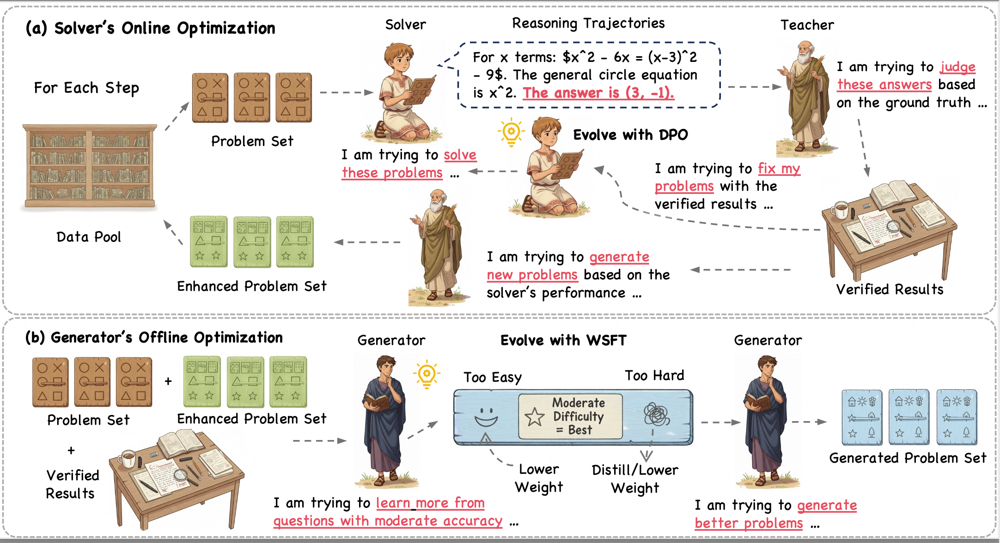

  
# Socratic-Zero: Bootstrapping Reasoning via Data-Free Agent Co-evolution   [](http://arxiv.org/abs/2509.24726)[](https://www.python.org/downloads/release/python-31013/)[](#license)


## Overview

Socratic-Zero is a fully autonomous framework that generates high-quality training data for mathematical reasoning from minimal seed examples through the co-evolution of three agents: the *Solver*, the *Teacher*, and the *Generator*. Starting from only 100 seed questions, our approach achieves significant improvements without relying on massive external datasets.
<div align="center">
  

  
</div>


<div align="center">
    
</div>

---

<p align="center">
  
  <br>
  <em>The Socratic-Zero Framework Pipeline</em>
</p>

## Key Results

<div align="center">
  
  <br>
  <em>Performance comparison across mathematical reasoning benchmarks</em>
</div>

- **Socratic-Solver-8B**: +20.2 percentage points average improvement across seven mathematical reasoning benchmarks
- **Socratic-Generator-32B**: Produces synthetic data enabling student models to outperform commercial LLMs
- **Cross-Architecture**: Consistent improvements on Qwen3 and GLM4 model families

## Installation

### Prerequisites

```bash
git clone https://github.com/Frostlinx/Socratic-Zero.git
cd Socratic-Zero
pip install -r requirements.txt
```

### Environment Setup

```bash
cp .env.example .env
```

Edit `.env` with your configuration:

```bash
# Model Paths
SOLVER_MODEL_PATH=/path/to/solver/model
GENERATOR_MODEL_PATH=/path/to/generator/model
TEACHER_BASE_URL=http://your-teacher-api-endpoint

# Training Configuration
WORKSPACE_DIR=/path/to/workspace
QUESTIONS_FILE=/path/to/seed_questions.json
TRL_NUM_PROCESSES=8

# GPU Configuration
PHYSICAL_SOLVER_GPU=4
PHYSICAL_TRAINING_GPUS=0,1,2,3,4,5,6,7
```

## Quick Start

### Verify Setup
```bash
python tools/utils/status_checker.py --quick
```

### Run Training

**Fully Automated Training (Recommended)**
```bash
python scripts/auto_trainer.py
```

**Semi-Automated Training**
```bash
python scripts/semi_auto_trainer.py
```

**Unified Launcher**
```bash
# Automated mode
python scripts/run_training.py

# Semi-automated mode
python scripts/run_training.py --mode semi
```

## Training Configuration

### Default Settings
```python
{
    "max_rounds": 5,                    # Total training rounds
    "save_rounds": [3, 4, 5],          # Checkpoint save rounds
    "attempts_per_question": 8,         # Solution attempts per question
    "training_framework": "TRL_DPO",   # Training framework
    "trl_mixed_precision": "bf16"      # Mixed precision training
}
```

### Training Features

**Fully Automated Mode**
- Complete automation with no manual intervention
- Smart retry mechanisms with configurable intervals
- Automatic error recovery and checkpoint resumption
- Comprehensive logging and progress tracking
- Graceful shutdown support (Ctrl+C)

**Semi-Automated Mode**
- Interactive control with manual stage progression
- Real-time monitoring and status information
- Flexible recovery options for failed stages
- Fine-grained control over training process

## Project Structure

```
Socratic-Zero/
├── scripts/                      # Training execution
│   ├── run_training.py           # Unified launcher
│   ├── auto_trainer.py           # Automated training
│   ├── semi_auto_trainer.py      # Interactive training
│   ├── evaluate_mean_at_k.py     # Evaluation script
│   ├── method.png               # Framework diagram
│   ├── pipeline.png             # Pipeline diagram
│   └── compare.png              # Results comparison
├── core/                         # Core components
│   └── state_manager.py          # State management
├── trainers/                     # Training modules
│   ├── trl_trainer.py            # TRL-based training
│   └── gpu_manager.py            # GPU management
├── processors/                   # Data processing
│   ├── solver_data_processor.py  # Data preparation
│   ├── question_enhancer.py      # Question generation
│   └── reward_calculator.py      # Reward computation
├── collectors/                   # Data collection
│   ├── trajectory_collector.py   # Trajectory sampling
│   └── data_normalizer.py        # Data standardization
├── managers/                     # System coordination
│   ├── round_controller.py       # Training coordination
│   └── question_manager.py       # Question management
├── datasets/                     # Dataset handling
│   ├── dpo_data_converter.py     # DPO conversion
│   └── data_saver.py             # Data persistence
└── src/evaluation/               # Evaluation
    ├── evaluator.py              # Model evaluation
    └── metrics.py                # Performance metrics
```

## Evaluation

### Solver Evaluation
```bash
python scripts/evaluate_mean_at_k.py \
    --model_path ./models/socratic-solver-8b \
    --benchmarks AMC23,AIME24,AIME25,MATH-500,GSM8K,Minerva,Olympiad \
    --num_samples 32 \
    --temperature 0.7
```

### Generator Quality Assessment
```bash
python src/evaluation/evaluator.py \
    --generator_model ./models/socratic-generator-32b \
    --test_seeds 1000 \
    --output_dir ./evaluation_results
```

## Results

### Solver Performance

| Model | AMC23 | AIME24 | AIME25 | MATH-500 | GSM8K | Minerva | Olympiad | Average |
|-------|-------|--------|--------|----------|-------|---------|----------|---------|
| Baseline | 45.8% | 12.3% | 11.4% | 62.7% | 74.6% | 41.9% | 35.9% | 40.7% |
| **Socratic-Zero** | **63.7%** | **28.4%** | **24.6%** | **81.2%** | **87.3%** | **52.4%** | **55.1%** | **56.1%** |
| **Improvement** | **+17.9** | **+16.1** | **+13.2** | **+18.5** | **+12.7** | **+10.5** | **+19.2** | **+15.4** |

### Generator Downstream Effectiveness

| Generator | AIME-24 | AIME-25 | AMC-23 | GSM8K | MATH-500 | Minerva | Olympiad | Average |
|-----------|---------|---------|--------|-------|----------|---------|----------|---------|
| Qwen3-32B | 9.2% | 10.0% | 44.4% | 75.7% | 55.7% | 15.1% | 24.5% | 34.97% |
| Qwen3-235B-A22B | 12.5% | 12.5% | 47.5% | 76.1% | 57.8% | 16.4% | 23.6% | 37.13% |
| Gemini-2.5-Pro | 10.0% | 15.0% | 46.9% | 78.1% | 57.2% | 16.0% | 25.4% | 37.20% |
| GPT5-global | 12.5% | 13.3% | 45.0% | 76.8% | 56.6% | 15.5% | 25.9% | 36.62% |
| Claude-4.1-Opus | 13.3% | 13.8% | 46.5% | 77.3% | 57.5% | 16.7% | 24.3% | 37.63% |
| **Socratic-Generator-32B** | **12.5%** | **13.3%** | **48.1%** | **77.6%** | **57.8%** | **18.4%** | **24.6%** | **37.72%** |

## Troubleshooting

### Common Issues

**Environment Setup**
```bash
# Check Python version
python --version  # Should be 3.10.13

# Verify GPU availability
python -c "import torch; print(torch.cuda.is_available())"

# Check model paths
ls $SOLVER_MODEL_PATH
```

**Training Issues**
```bash
# Resume interrupted training
python scripts/auto_trainer.py --resume

# Check training status
python tools/utils/status_checker.py

# Clear GPU memory
python -c "import torch; torch.cuda.empty_cache()"
```

**Memory Management**
```bash
# Monitor GPU usage
nvidia-smi

# Check disk space
df -h $WORKSPACE_DIR
```

### Log Files

- **Training Logs**: `{WORKSPACE_DIR}/logs/`
- **Checkpoints**: `{WORKSPACE_DIR}/checkpoints/`
- **Training State**: `{WORKSPACE_DIR}/training_state.json`
- **Results**: `{WORKSPACE_DIR}/training_results/`

## Hardware Requirements

- **Training**: 8×NVIDIA H20 GPUs (96GB HBM3 each)
- **Teacher Inference**: 16×AMD MI308X GPUs (192GB HBM3 each)
- **Storage**: ~1TB for training data and checkpoints
- **Memory**: ~768GB total training memory

## Citation

```bibtex
@misc{wang2025socraticzerobootstrappingreasoning,
      title={Socratic-Zero : Bootstrapping Reasoning via Data-Free Agent Co-evolution}, 
      author={Shaobo Wang and Zhengbo Jiao and Zifan Zhang and Yilang Peng and Xu Ze and Boyu Yang and Wei Wang and Hu Wei and Linfeng Zhang},
      year={2025},
      eprint={2509.24726},
      archivePrefix={arXiv},
      primaryClass={cs.CL},
      url={https://arxiv.org/abs/2509.24726}, 
}
```


