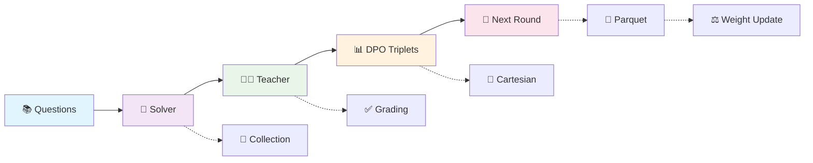

<div align="center">
  
  
  # Socratic-Zero
  
  **Bootstrapping Reasoning via Data-Free Agent Co-evolution**
  
  [](http://arxiv.org/abs/2509.24726)
  [](https://www.python.org/downloads/)
  [](#license)
  
</div>

---

## 🎯 Overview

<p align="center">
  
  <br>
  <em>The Socratic-Zero Framework: Multi-Agent Co-evolutionary System Pipeline</em>
</p>

ProSetting is the implementation of the Socratic-Zero framework - a progressive reinforcement learning training system that enables iterative training of mathematical reasoning models through co-evolution of three agents: **Solver**, **Teacher**, and **Generator**. Starting from only 100 seed questions, our approach achieves significant improvements without relying on massive external datasets.

### 🏆 Key Results

<div align="center">
  
  <br>
  <em>Solver and Generator Performance Comparison</em>
</div>

- **🧠 Socratic-Solver-8B**: Achieves **+20.2 percentage points** average improvement across seven mathematical reasoning benchmarks
- **🏭 Socratic-Generator-32B**: Produces synthetic data enabling student models to outperform commercial LLMs including GPT-5, Gemini-2.5-Pro, and Claude-4.1-Opus
- **🔄 Cross-Architecture**: Consistent improvements on Qwen3 and GLM4 model families

## 🏗️ Architecture

### Core Components

<div align="center">
  
| Component | Role | Description |
|-----------|------|-------------|
| 🧠 **Solver Model** | Reasoning Agent | Mathematical reasoning model that learns from preference feedback |
| 👨‍🏫 **Teacher Model** | Oracle & Evaluator | Fixed oracle providing evaluation and strategic problem generation |
| 🏭 **Generator Model** | Curriculum Designer | Learns to distill Teacher's curriculum design strategy |
| ⚙️ **Training Frameworks** | Execution Engine | Supports both VERL PPO and TRL DPO (recommended) |

</div>

### Training Flow



## 📁 Project Structure

```
ProSetting/
├── 📜 scripts/
│   ├── run_training.py           # 🚀 Unified training launcher
│   ├── auto_trainer.py           # 🤖 Fully automated training (recommended)
│   ├── semi_auto_trainer.py      # 🎮 Interactive training
│   ├── method.pdf               # 🖼️ Framework overview figure
│   ├── pipeline.pdf             # 🔄 Detailed pipeline diagram
│   └── comparison (1).pdf       # 📊 Results comparison chart
├── 🗂️ collectors/                # Data collection modules
│   ├── trajectory_collector.py   # 🔄 Multi-GPU trajectory generation
│   └── data_normalizer.py        # 📏 Data standardization
├── ⚙️ processors/                # Data processing modules
│   ├── reward_calculator.py      # 🏆 Teacher-based reward computation
│   ├── question_enhancer.py      # 📈 Progressive question generation
│   └── solver_data_processor.py  # 🔧 Training data preparation
├── 💾 datasets/                  # Dataset management
│   ├── dpo_data_converter.py     # 🔄 DPO format conversion
│   └── data_saver.py             # 💾 Data persistence
├── 🏋️ trainers/                 # Training execution
│   ├── trl_trainer.py            # 🎯 TRL-based training
│   └── gpu_manager.py            # 🖥️ Resource management
├── 🎛️ managers/                 # System management
│   ├── round_controller.py       # 🔄 Multi-round coordination
│   └── question_manager.py       # ❓ Question pool management
└── 🧠 core/                     # Core utilities
    └── state_manager.py          # 💾 Training state persistence
```

## 🚀 Quick Start

### Environment Setup

```bash
# 1. Clone the repository
git clone https://github.com/Frostlinx/Socratic-Zero.git
cd Socratic-Zero

# 2. Install dependencies
pip install -r requirements.txt

# 3. Configure environment variables
cp .env.example .env
# Edit .env file with key parameters:
# SOLVER_MODEL_PATH=/path/to/solver/model
# QUESTIONS_FILE=/path/to/questions.json
# WORKSPACE_DIR=/path/to/workspace
# TRL_NUM_PROCESSES=8
# TEACHER_BASE_URL=http://your-teacher-api

# 4. Verify environment
python utils/status_checker.py --quick
```

### 🎮 Running Training

#### 1. Unified Launcher (Recommended)
```bash
cd /home/project/ProSetting

# 🤖 Fully automated training (default)
python scripts/run_training.py

# 🎮 Semi-automated training
python scripts/run_training.py --mode semi
```

#### 2. Direct Training Scripts
```bash
cd /home/project/ProSetting

# 🤖 Fully automated TRL training (recommended)
python scripts/auto_trainer.py

# 🎮 Semi-automated TRL training
python scripts/semi_auto_trainer.py
```

#### 3. System Testing
```bash
# 🧪 Quick system logic test
python utils/test_runner.py

# 📊 System status check
python utils/status_checker.py

# ⚡ Quick status check
python utils/status_checker.py --quick
```

## ⚙️ Training Features

### 🤖 Fully Automated Training (Recommended)

<details>
<summary>📋 Click to expand features</summary>

- **🔄 Complete Automation**: No manual intervention required
- **🔁 Smart Retry**: Configurable retry mechanism with intervals
- **🛠️ Error Recovery**: Option to skip or stop on training failures
- **💾 Checkpoint Recovery**: Resume from any stage
- **🖥️ Resource Management**: Automatic GPU memory cleanup
- **📝 Detailed Logging**: Complete training process records and final reports
- **⚡ Signal Handling**: Graceful shutdown support (Ctrl+C)

</details>

## ⚙️ Configuration

### Default Configuration
```python
{
    "max_rounds": 5,                    # 🔄 Total training rounds
    "save_rounds": [3, 4, 5],          # 💾 Checkpoint save rounds
    "attempts_per_question": 8,         # 🎯 Attempts per question
    "physical_solver_gpu": "4",         # 🖥️ Solver model GPU
    "physical_grpo_gpu": "0,1,2,3,4,5,6,7",  # 🖥️ Training GPUs
    "training_framework": "TRL_DPO",   # 🏋️ Training framework
    "trl_num_processes": 8,            # ⚡ TRL training processes
    "trl_mixed_precision": "bf16"      # 🎯 Mixed precision training
}
```

### 🎯 Model Paths
- **🧠 Solver Model**: Configure in `SOLVER_MODEL_PATH`
- **🏭 Generator Model**: Configure in `GENERATOR_MODEL_PATH`  
- **📚 Question Data**: Configure in `QUESTIONS_FILE`
- **👨‍🏫 Teacher API**: Configure in `TEACHER_BASE_URL`

## 🌟 Core Features

### 1. 📈 Progressive Training Strategy
- **🔄 Rounds 1-2**: Data accumulation phase without model updates
- **🚀 Round 3+**: Active training with progressive weight transfer
- **📚 Question Pool Evolution**: Systematic expansion through teacher-guided enhancement
- **🛠️ Failure Recovery**: Automatic replay of failed questions with enhanced variants

### 2. 🔄 Inter-Round Weight Transfer
- Round 1 uses original weights
- Round 2+ automatically loads previous round results
- Supports FSDP distributed weight auto-merging

### 3. 💾 Data Persistence
- All training data permanently saved
- Standardized file naming conventions
- Training state recovery support

### 4. 🧩 Modular Architecture
- Separated data collection, processing, training, and management modules
- Independent testing and maintenance support
- Complete error handling mechanisms


### 🚀 Parallel Strategy
- **📊 Data collection**: Multi-GPU parallel with intelligent task allocation
- **✅ Grading processing**: 32 concurrent Teacher API calls
- **📈 Question enhancement**: 32 concurrent Teacher2 processing

## 🔧 Troubleshooting

### Common Issues

<details>
<summary>🚨 Model path not found</summary>

```bash
export SOLVER_MODEL_PATH="/correct/path/to/model"
```
</details>

<details>
<summary>🖥️ GPU memory insufficient</summary>

- Check GPU usage: `nvidia-smi`
- Adjust batch_size or reduce parallelism
</details>

<details>
<summary>💾 Checkpoint merge failure</summary>

- Check checkpoint directory permissions
- Confirm FSDP weight files are complete
</details>

<details>
<summary>🔄 Training interruption recovery</summary>

```bash
# 🤖 Fully automated training recovery
python scripts/auto_trainer.py

# 🎮 Semi-automated training recovery
python scripts/semi_auto_trainer.py

# 📊 Check recovery status
python utils/status_checker.py
```
</details>

### 📝 Log Files
- **🏋️ TRL Training Log**: `/tmp/trl_trainer.log`
- **🤖 Automated Training Log**: `/tmp/auto_trainer.log`
- **📊 Training Output**: Real-time console output
- **💾 State Files**: `{WORKSPACE_DIR}/training_state.json`
- **📈 Round Progress**: `{WORKSPACE_DIR}/round_XX_progress.json`
- **📊 Training Results**: `{WORKSPACE_DIR}/training_results/`
- **📋 Training Summary**: `{WORKSPACE_DIR}/auto_training_summary.json`
- **💾 Checkpoint Files**: `{WORKSPACE_DIR}/checkpoint_round_X.json`

## 👨‍💻 Development Guide

### Adding New Modules
1. Create new file in appropriate directory
2. Implement standard interfaces and error handling
3. Update corresponding `__init__.py` exports
4. Add unit tests

### Custom Training Strategies
1. Modify `RoundController` configuration
2. Adjust question pool building logic
3. Customize reward calculation functions

### Extending Data Formats
1. Update `StateManager` file naming
2. Modify data save and load logic
3. Ensure backward compatibility

## 📚 Citation

If you use this code in your research, please cite:

```bibtex
@article{socratic2024,
  title={Socratic-Zero: Bootstrapping Reasoning via Data-Free Agent Co-evolution},
  author={Wang, Shaobo and Jiao, Zhengbo and Zhang, Zifan and Peng, Yilang and Ze, Xu and Yang, Boyu and Wang, Wei and Wei, Hu and Zhang, Linfeng},
  journal={arXiv preprint arXiv:2509.24726},
  year={2024},
  url={http://arxiv.org/abs/2509.24726}
}
```

## 📄 License

This project follows internal use license, for research and development only.

## 🤝 Support

For questions or suggestions, please contact the development team or check project documentation.

---

<div align="center">
  
  <br>
  <strong>🎓 Bootstrapping Reasoning Through Socratic Dialogue 🎓</strong>
  <br>
  <em>Systematic co-evolutionary training for mathematical reasoning advancement</em>
</div>

